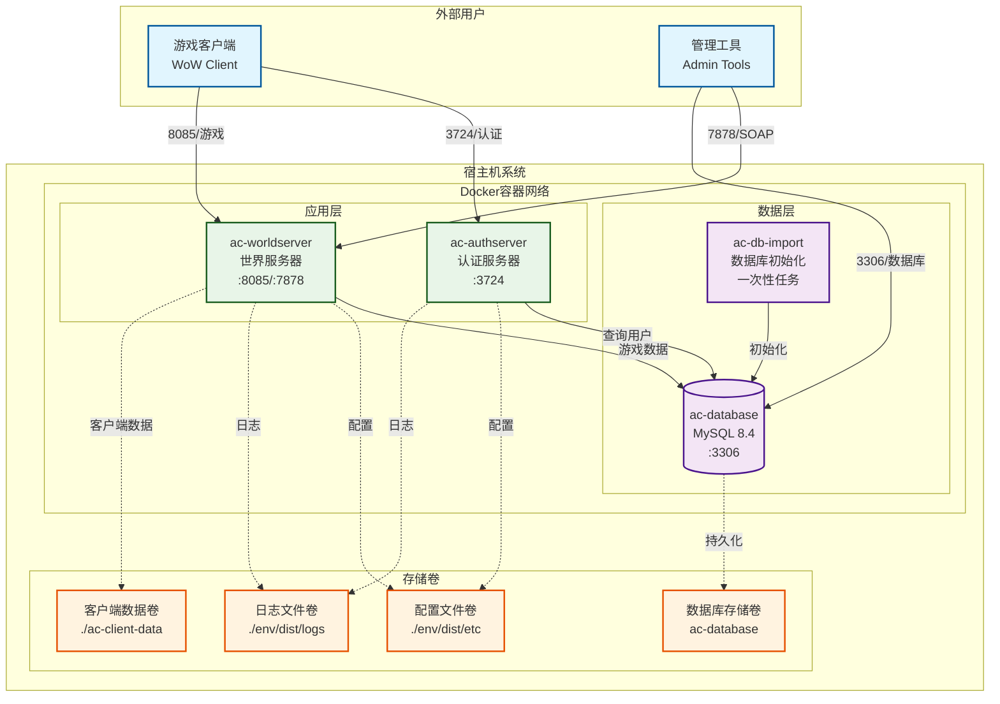
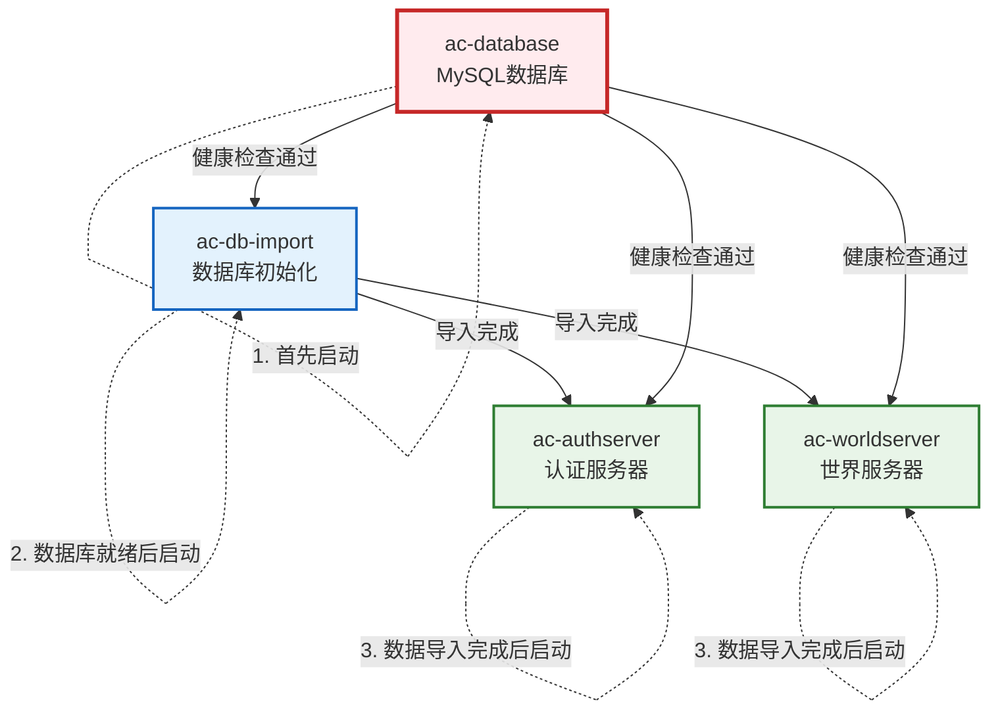
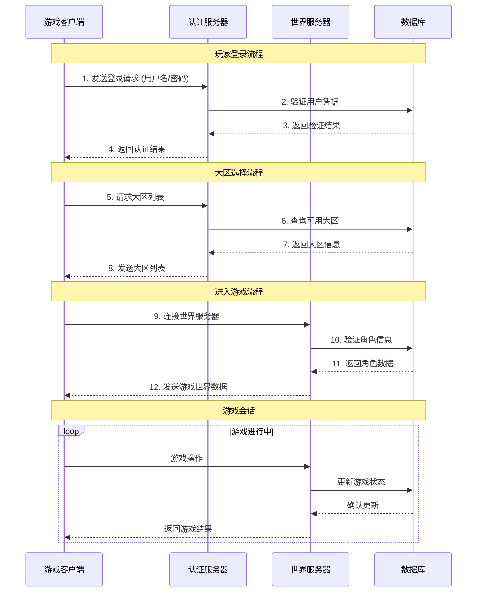
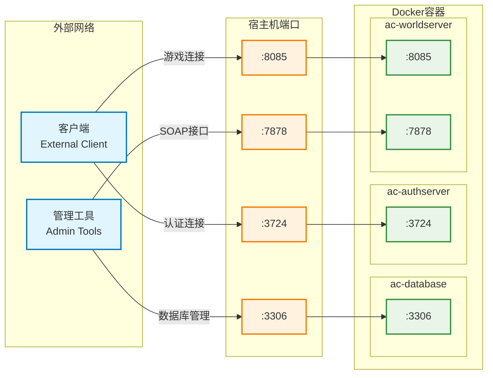

# AzerothCore Docker 部署指南

## 目录

1. [环境要求](#环境要求)
2. [目录结构](#目录结构)
3. [快速开始](#快速开始)
4. [服务架构](#服务架构)
5. [服务详细配置](#服务详细配置)
   - [数据库服务 (ac-database)](#数据库服务-ac-database)
   - [数据库导入服务 (ac-db-import)](#数据库导入服务-ac-db-import)
   - [认证服务器 (ac-authserver)](#认证服务器-ac-authserver)
   - [世界服务器 (ac-worldserver)](#世界服务器-ac-worldserver)
6. [启动顺序与依赖关系](#启动顺序与依赖关系)
7. [环境变量配置](#环境变量配置)
8. [挂载目录说明](#挂载目录说明)
9. [多大区部署](#多大区部署)
10. [常用命令](#常用命令)
11. [故障排除](#故障排除)

## 环境要求

- Docker Engine 20.10+
- Docker Compose 2.0+
- 最小系统配置:
  - CPU: 2核心
  - 内存: 4GB
  - 存储: 10GB
- 推荐系统配置:
  - CPU: 4核心
  - 内存: 8GB
  - 存储: 20GB

## 目录结构

项目基础目录为 `/data/azerothcore`，完整目录结构如下：

```
/data/azerothcore/
├── ac-client-data/     # 客户端数据文件
├── conf/
│   └── dist/
│       └── env.ac      # 环境配置文件
├── env/
│   └── dist/
│       ├── etc/        # 配置文件
│       └── logs/       # 日志文件
└── docker-compose.yml  # Docker Compose配置文件
```

## 快速开始

1. 创建基础目录：
```bash
mkdir -p /data/azerothcore
cd /data/azerothcore
```

2. 克隆仓库并进入目录：
```bash
git clone git@github.com:duckdream/demo.git .
```

3. 准备客户端数据：
```bash
# 下载客户端数据文件
cd /data/azerothcore
wget http://10.10.0.109/downloads/data.zip
unzip data.zip -d ac-client-data
rm data.zip
```

4. 启动服务器：
```bash
docker compose up -d
```

## 服务架构

AzerothCore Docker部署包含以下核心服务：

1. **数据库服务 (ac-database)**
   - 基于MySQL 8.4
   - 存储游戏所有数据

2. **数据库导入服务 (ac-db-import)**
   - 初始化数据库结构和数据
   - 一次性服务，完成后自动退出

3. **认证服务器 (ac-authserver)**
   - 处理玩家账号验证
   - 管理大区列表

4. **世界服务器 (ac-worldserver)**
   - 处理游戏世界逻辑
   - 管理玩家角色和游戏内容

### 系统架构图



### 服务依赖关系图



### 数据流程图



### 网络端口映射图



## 服务详细配置

### 数据库服务 (ac-database)

**镜像**: mysql:8.4

**端口映射**:
- `${DOCKER_DB_EXTERNAL_PORT:-3306}:3306` (默认: 3306)

**环境变量**:
- `MYSQL_ROOT_PASSWORD`: 数据库root密码 (默认: password)

**挂载卷**:
- `ac-database:/var/lib/mysql`: 数据库文件持久化存储

**健康检查**:
- 命令: `/usr/bin/mysql --user=root --password=$MYSQL_ROOT_PASSWORD --execute "SHOW DATABASES;"`
- 间隔: 5秒
- 超时: 10秒
- 重试次数: 40次

**重启策略**: unless-stopped (除非手动停止，否则总是重启)

### 数据库导入服务 (ac-db-import)

**镜像**: registry.cn-shanghai.aliyuncs.com/demo-sh/ac-wotlk-db-import:${DOCKER_IMAGE_TAG:-master}

**环境变量**:
- `AC_DATA_DIR`: 客户端数据目录 (值: "/azerothcore/env/dist/data")
- `AC_LOGS_DIR`: 日志目录 (值: "/azerothcore/env/dist/logs")
- `AC_LOGIN_DATABASE_INFO`: 认证数据库连接信息 (值: "ac-database;3306;root;${DOCKER_DB_ROOT_PASSWORD:-password};acore_auth")
- `AC_WORLD_DATABASE_INFO`: 世界数据库连接信息 (值: "ac-database;3306;root;${DOCKER_DB_ROOT_PASSWORD:-password};acore_world")
- `AC_CHARACTER_DATABASE_INFO`: 角色数据库连接信息 (值: "ac-database;3306;root;${DOCKER_DB_ROOT_PASSWORD:-password};acore_characters")

**挂载目录**:
- `${DOCKER_VOL_ETC:-./env/dist/etc}:/azerothcore/env/dist/etc`: 配置文件目录
- `${DOCKER_VOL_LOGS:-./env/dist/logs}:/azerothcore/env/dist/logs:delegated`: 日志文件目录

**依赖条件**:
- 依赖于 ac-database 服务的健康状态 (condition: service_healthy)

### 认证服务器 (ac-authserver)

**镜像**: registry.cn-shanghai.aliyuncs.com/demo-sh/ac-wotlk-authserver:${DOCKER_IMAGE_TAG:-master}

**端口映射**:
- `${DOCKER_AUTH_EXTERNAL_PORT:-3724}:3724` (默认: 3724)

**环境变量文件**:
- `${DOCKER_AC_ENV_FILE:-conf/dist/env.ac}` (默认: conf/dist/env.ac)

**环境变量**:
- `AC_LOGS_DIR`: 日志目录 (值: "/azerothcore/env/dist/logs")
- `AC_TEMP_DIR`: 临时文件目录 (值: "/azerothcore/env/dist/temp")
- `AC_LOGIN_DATABASE_INFO`: 认证数据库连接信息 (值: "ac-database;3306;root;${DOCKER_DB_ROOT_PASSWORD:-password};acore_auth")

**挂载目录**:
- `${DOCKER_VOL_ETC:-./env/dist/etc}:/azerothcore/env/dist/etc`: 配置文件目录
- `${DOCKER_VOL_LOGS:-./env/dist/logs}:/azerothcore/env/dist/logs:delegated`: 日志文件目录

**依赖条件**:
- 依赖于 ac-database 服务的健康状态 (condition: service_healthy)
- 依赖于 ac-db-import 服务的成功完成 (condition: service_completed_successfully)

**重启策略**: unless-stopped (除非手动停止，否则总是重启)

### 世界服务器 (ac-worldserver)

**镜像**: registry.cn-shanghai.aliyuncs.com/demo-sh/ac-wotlk-worldserver:${DOCKER_IMAGE_TAG:-master}

**端口映射**:
- `${DOCKER_WORLD_EXTERNAL_PORT:-8085}:8085` (默认: 8085): 世界服务器端口
- `${DOCKER_SOAP_EXTERNAL_PORT:-7878}:7878` (默认: 7878): SOAP接口端口

**环境变量文件**:
- `${DOCKER_AC_ENV_FILE:-./conf/dist/env.ac}` (默认: ./conf/dist/env.ac)

**环境变量**:
- `AC_DATA_DIR`: 客户端数据目录 (值: "/azerothcore/env/dist/data")
- `AC_LOGS_DIR`: 日志目录 (值: "/azerothcore/env/dist/logs")
- `AC_LOGIN_DATABASE_INFO`: 认证数据库连接信息 (值: "ac-database;3306;root;${DOCKER_DB_ROOT_PASSWORD:-password};acore_auth")
- `AC_WORLD_DATABASE_INFO`: 世界数据库连接信息 (值: "ac-database;3306;root;${DOCKER_DB_ROOT_PASSWORD:-password};acore_world")
- `AC_CHARACTER_DATABASE_INFO`: 角色数据库连接信息 (值: "ac-database;3306;root;${DOCKER_DB_ROOT_PASSWORD:-password};acore_characters")

**挂载目录**:
- `${DOCKER_VOL_ETC:-./env/dist/etc}:/azerothcore/env/dist/etc`: 配置文件目录
- `${DOCKER_VOL_LOGS:-./env/dist/logs}:/azerothcore/env/dist/logs:delegated`: 日志文件目录
- `${DOCKER_VOL_DATA:-./ac-client-data}:/azerothcore/env/dist/data/:ro`: 客户端数据目录 (只读)

**依赖条件**:
- 依赖于 ac-database 服务的健康状态 (condition: service_healthy)
- 依赖于 ac-db-import 服务的成功完成 (condition: service_completed_successfully)

**重启策略**: unless-stopped (除非手动停止，否则总是重启)

## 启动顺序与依赖关系

服务启动顺序由依赖关系决定，具体如下：

1. **ac-database**
   - 首先启动数据库服务
   - 等待数据库健康检查通过

2. **ac-db-import**
   - 在数据库服务健康后启动
   - 导入所有必要的数据库结构和数据
   - 完成后自动退出

3. **ac-authserver** 和 **ac-worldserver**
   - 在数据库服务健康且数据库导入服务成功完成后启动
   - 两者可以并行启动，没有相互依赖

依赖关系图：
```
ac-database (健康状态)
    ↓
ac-db-import (成功完成)
    ↓
  ┌─────────────┐
  ↓             ↓
ac-authserver  ac-worldserver
```

## 环境变量配置

可以通过环境变量或 `env.ac` 文件配置以下参数：

### 基础环境变量

| 环境变量 | 描述 | 默认值 |
|---------|------|-------|
| DOCKER_IMAGE_TAG | Docker镜像标签 | master |
| DOCKER_DB_ROOT_PASSWORD | 数据库root密码 | password |
| DOCKER_AC_ENV_FILE | 环境配置文件路径 | ./conf/dist/env.ac |

### 端口配置

| 环境变量 | 描述 | 默认值 |
|---------|------|-------|
| DOCKER_DB_EXTERNAL_PORT | 数据库外部端口 | 3306 |
| DOCKER_AUTH_EXTERNAL_PORT | 认证服务器外部端口 | 3724 |
| DOCKER_WORLD_EXTERNAL_PORT | 世界服务器外部端口 | 8085 |
| DOCKER_SOAP_EXTERNAL_PORT | SOAP接口外部端口 | 7878 |

### 目录配置

| 环境变量 | 描述 | 默认值 |
|---------|------|-------|
| DOCKER_VOL_ETC | 配置文件目录 | ./env/dist/etc |
| DOCKER_VOL_LOGS | 日志文件目录 | ./env/dist/logs |
| DOCKER_VOL_DATA | 客户端数据目录 | ./ac-client-data |

## 挂载目录说明

### 1. 配置文件目录 (${DOCKER_VOL_ETC:-./env/dist/etc})

包含所有服务器配置文件：
- `authserver.conf`: 认证服务器配置
- `worldserver.conf`: 世界服务器配置
- `dbimport.conf`: 数据库导入配置
- 其他配置文件

### 2. 日志文件目录 (${DOCKER_VOL_LOGS:-./env/dist/logs})

包含所有服务器日志文件：
- `auth.log`: 认证服务器日志
- `world.log`: 世界服务器日志
- `db-import.log`: 数据库导入日志
- 其他日志文件

### 3. 客户端数据目录 (${DOCKER_VOL_DATA:-./ac-client-data})

包含游戏客户端数据文件：
- `dbc/`: 客户端DBC文件
- `maps/`: 地图文件
- `vmaps/`: 可视地图文件
- `mmaps/`: 移动地图文件

## 多大区部署

要部署多个大区，需要为每个额外的大区创建以下服务：

1. 额外的数据库导入服务 (ac-db-import2, ac-db-import3, ...)
2. 额外的世界服务器 (ac-worldserver2, ac-worldserver3, ...)

### 配置大区列表

```sql
# 连接数据库
docker exec -it ac-database mysql -uroot -p

# 配置大区列表
USE acore_auth;
INSERT INTO realmlist (id, name, address, port) 
VALUES (1, '大区1', '服务器IP', 8085);
INSERT INTO realmlist (id, name, address, port) 
VALUES (2, '大区2', '服务器IP', 8086);
```

### 创建游戏账号
```bash
# 连接到世界服务器控制台
docker attach ac-worldserver

# 创建账号
account create 用户名 密码

# 设置账号权限（可选，3为GM权限）
account set gmlevel 用户名 3 -1

# 退出控制台（按 Ctrl+P 然后 Ctrl+Q）
```
