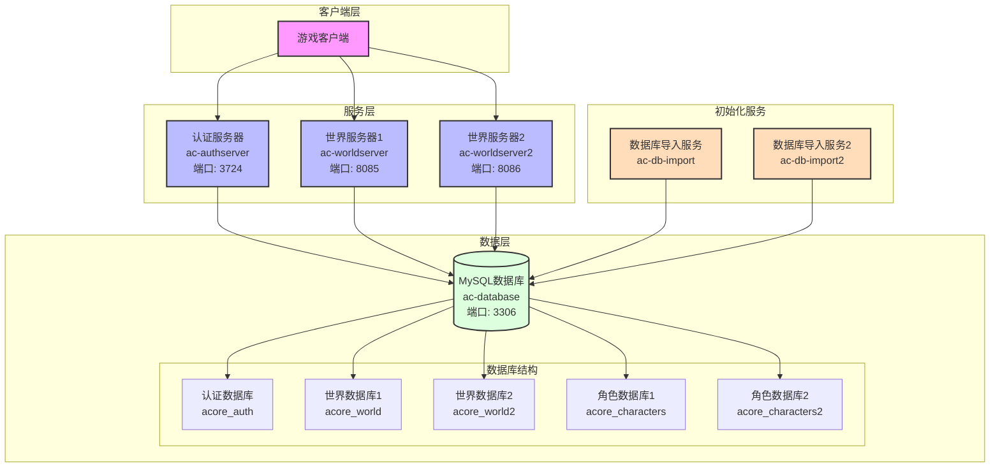

# AzerothCore Docker 部署指南

## 环境要求

- Docker
- Docker Compose
- AzerothCore 3.3.5a 客户端数据文件

## 目录结构

项目基础目录为 `/data/azerothcore`，完整目录结构如下：

```
/data/azerothcore/
├── ac-client-data/     # 客户端数据文件
├── conf/
│   └── dist/
│       └── env.ac     # 环境配置文件
├── env/
│   └── dist/
│       ├── etc/       # 配置文件
│       └── logs/      # 日志文件
└── docker-compose.yml # 部署工程->参考此README自行编写
```

## 快速开始

1. 创建基础目录：
```bash
mkdir -p /data/azerothcore
cd /data/azerothcore
```

2. 克隆仓库并进入目录：
```bash
git clone git@github.com:duckdream/demo.git .
```

3. 准备客户端数据：
```bash
# 下载客户端数据文件
cd /data/azerothcore
wget http://10.10.0.109/downloads/data.zip
unzip data.zip -d ac-client-data
rm data.zip
```

4. 启动服务器：
```bash
docker compose up -d
```
## 系统架构



系统架构说明：
1. 客户端层：游戏客户端通过认证服务器进行身份验证，然后连接到世界服务器
2. 服务层：
   - 认证服务器：处理玩家登录认证
   - 世界服务器：处理游戏逻辑和玩家交互
3. 数据层：
   - MySQL数据库：存储所有游戏数据
   - 数据库结构：包含认证、世界和角色数据
4. 初始化服务：
   - 数据库导入服务：负责初始化数据库结构和数据


## 服务说明

### 服务镜像地址
- 认证服务器：`registry.cn-shanghai.aliyuncs.com/demo-sh/ac-wotlk-authserver:master`
- 世界服务器：`registry.cn-shanghai.aliyuncs.com/demo-sh/ac-wotlk-worldserver:master`
- 数据库导入服务：`registry.cn-shanghai.aliyuncs.com/demo-sh/ac-wotlk-db-import:master`

### 服务依赖关系
```
+------------------+     +------------------+
|   数据库服务       |     |  数据库导入服务    |
|  ac-database     |---->|  ac-db-import    |
+------------------+     +------------------+
        |                        |
        |                        |
        v                        v
+------------------+     +------------------+
|   认证服务器       |     |   世界服务器      |
|  ac-authserver   |---->|  ac-worldserver  |
+------------------+     +------------------+
```
服务依赖说明：
1. 数据库服务 (ac-database) 是基础服务，其他所有服务都依赖于它
2. 数据库导入服务 (ac-db-import) 依赖于数据库服务，用于初始化数据库
3. 认证服务器 (ac-authserver) 依赖于数据库服务
4. 世界服务器 (ac-worldserver) 依赖于：
   - 数据库服务
   - 认证服务器
   - 数据库导入服务（首次启动时需要）

### 数据库服务 (ac-database)
- 使用 MySQL 8.4
- 默认端口：3306
- 数据持久化存储
- 环境变量：
  - `DOCKER_DB_EXTERNAL_PORT`：数据库外部端口（默认：3306）
  - `DOCKER_DB_ROOT_PASSWORD`：数据库 root 密码（默认：password）
- 目录挂载：
  - `/var/lib/mysql`：数据库文件存储目录

### 数据库导入服务 (ac-db-import)
- 用于导入初始数据库结构和数据
- 环境变量：
  - `AC_LOGIN_DATABASE_INFO`：认证数据库连接信息
  - `AC_WORLD_DATABASE_INFO`：世界数据库连接信息
  - `AC_CHARACTER_DATABASE_INFO`：角色数据库连接信息
- 目录挂载：
  - `/azerothcore/env/dist/etc`：配置文件目录
  - `/azerothcore/env/dist/logs`：日志文件目录

### 世界服务器 (ac-worldserver)
- 端口：
  - 8085：世界服务器端口
  - 7878：SOAP 接口端口
- 环境变量：
  - `DOCKER_WORLD_EXTERNAL_PORT`：世界服务器外部端口（默认：8085）
  - `DOCKER_SOAP_EXTERNAL_PORT`：SOAP 接口外部端口（默认：7878）
  - `AC_REALM_ID`：服务器ID（必须唯一）
- 目录挂载：
  - `/azerothcore/env/dist/etc`：配置文件目录
  - `/azerothcore/env/dist/logs`：日志文件目录
  - `/azerothcore/env/dist/data`：客户端数据目录（只读）

### 认证服务器 (ac-authserver)
- 端口：3724
- 环境变量：
  - `DOCKER_AUTH_EXTERNAL_PORT`：认证服务器外部端口（默认：3724）
- 目录挂载：
  - `/azerothcore/env/dist/etc`：配置文件目录
  - `/azerothcore/env/dist/logs`：日志文件目录

## 多世界服务器配置

### 1. 配置新的世界服务器
创建新的服务配置：

1. 添加新的数据库导入服务（ac-db-import2）：
   - 设置新的数据库名称（world和characters）
   - 配置数据库连接信息
   - 设置配置和日志目录挂载

2. 添加新的世界服务器（ac-worldserver2）：
   - 设置唯一的RealmID
   - 配置新的端口（避免冲突）
   - 设置数据库连接信息
   - 配置目录挂载

配置说明：
```bash
# 数据库导入服务配置
AC_LOGIN_DATABASE_INFO="ac-database;3306;root;${DOCKER_DB_ROOT_PASSWORD:-password};acore_auth"
AC_WORLD_DATABASE_INFO="ac-database;3306;root;${DOCKER_DB_ROOT_PASSWORD:-password};acore_world2"  # 新的world数据库
AC_CHARACTER_DATABASE_INFO="ac-database;3306;root;${DOCKER_DB_ROOT_PASSWORD:-password};acore_characters2"  # 新的characters数据库

# 世界服务器配置
AC_REALM_ID="2"  # 必须唯一，不能与其他服务器重复
DOCKER_WORLD_EXTERNAL_PORT2="8086"  # 新的世界服务器端口
DOCKER_SOAP_EXTERNAL_PORT2="7879"  # 新的SOAP端口
```

### 2. 启动新大区
```bash
# 启动新的世界服务器（会自动创建和导入数据库）
docker compose up -d ac-worldserver2

# 查看启动进度
docker compose logs -f ac-worldserver2
```

### 3. 配置大区列表
```sql
# 连接数据库
docker exec -it ac-database mysql -uroot -p

# 配置新大区
USE acore_auth;
INSERT INTO realmlist (name, address, port) 
VALUES ('新大区名称', '服务器IP', 8086);  # 使用新大区的实际信息
```

### 4. 创建玩家账号
```bash
# 连接到世界服务器控制台
docker attach ac-worldserver2

# 创建账号（在控制台中输入）
account create 玩家用户名 玩家密码

# 退出控制台（按 Ctrl+P 然后 Ctrl+Q）
```

## 注意事项

1. 每个世界服务器需要：
   - 独立的数据库（world和characters）
   - 唯一的RealmID
   - 独立的端口配置
   - 独立的数据库导入服务
2. 确保客户端数据文件完整且正确
3. 建议定期备份数据库数据
4. 修改配置后需要重启相关服务才能生效

## 常用命令

- 启动服务：
```bash
docker compose up -d
```

- 停止服务：
```bash
docker compose down
```

- 查看日志：
```bash
docker compose logs -f
```

- 重启服务：
```bash
docker compose restart
```

## 故障排除

1. 如果服务无法启动，检查：
   - 端口是否被占用
   - 环境变量是否正确
   - 客户端数据是否完整

2. 如果数据库连接失败：
   - 检查数据库密码是否正确
   - 确认数据库服务是否正常运行

3. 如果世界服务器无法启动：
   - 检查日志文件
   - 确认客户端数据文件是否完整
   - 验证配置文件是否正确